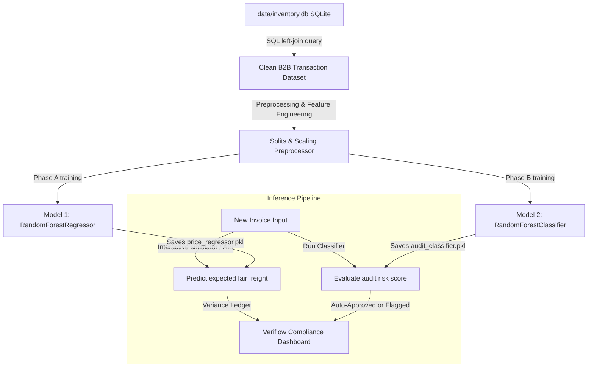
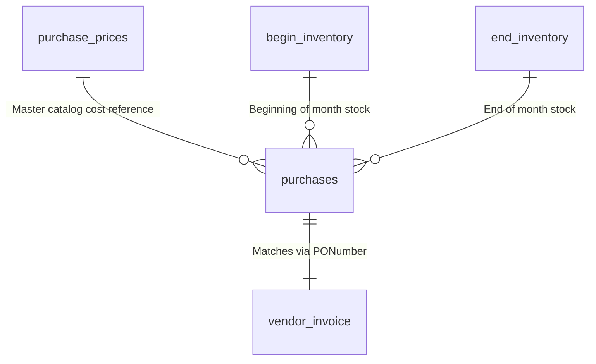
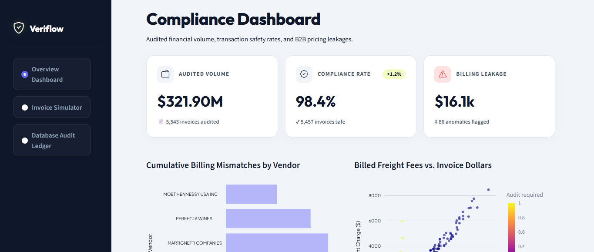
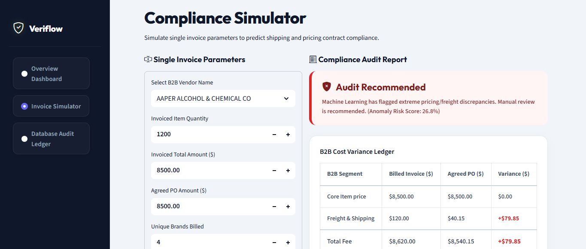
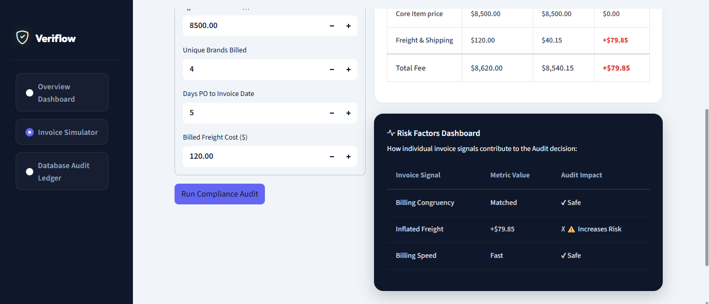
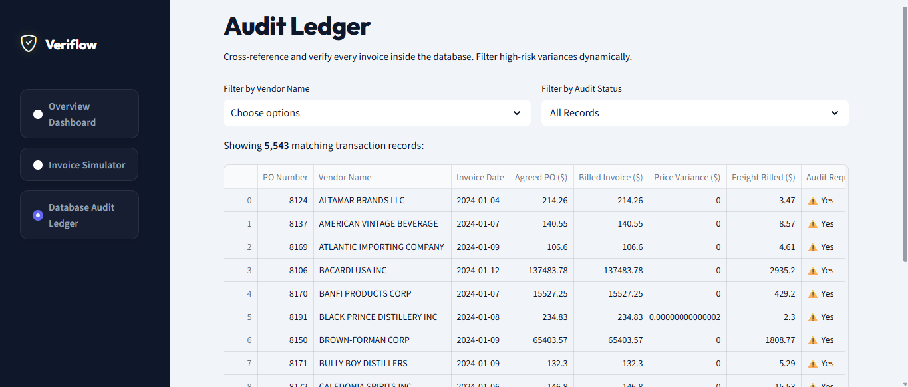

# 🛡️ Veriflow: B2B Revenue Leakage & Invoice Auditing System
### 🚀 A Production-Oriented Dual-Model Machine Learning Platform for Enterprise Financial Compliance

[](https://www.python.org/)
[](https://opensource.org/licenses/Apache-2.0)
[](https://streamlit.io/)
[](https://scikit-learn.org/)

---

## 📈 Case Study & Business Value

Large companies pay thousands of B2B invoices every month. Because contracts and shipping rates are complicated, companies end up overpaying suppliers by **1% to 5% every year** due to manual billing errors and inflated freight charges. 

This app automatically compares invoices against original purchase orders (PO) to find price differences and flag suspicious shipping rates for manual review.

### 💡 Core Auditing Business Value:
* **Automated Clearance:** Automatically approves normal, low-risk invoices so auditors can focus only on the highly suspicious ones.
* **Plugs Revenue Leakage:** Flags price variances and inflated shipping/freight charges before the bills are actually paid.
* **Tracks Vendor Patterns:** Surfaces historical patterns of invoice inflation and billing delays per supplier.

---

## 🗺️ How it Works (System Architecture)



---

## 🗄️ Database & Schema Details

The app connects to a **424MB SQLite Database (`inventory.db`)** representing Bibitor, LLC, a retail wine and spirits distributor with around 80 stores. The data is structured across five relational tables:



### 1. `purchases` (Store Purchase Orders)
Records the original purchase orders placed by the stores.
* **Key Columns:**
  * `InventoryId` (TEXT): Unique product SKU.
  * `Store` (BIGINT): Retail store ID.
  * `Brand` (BIGINT): Brand inventory number.
  * `Description` (TEXT): Product description (e.g., *Grey Goose*, *Bombay Sapphire*).
  * `PONumber` (BIGINT): Purchase Order number.
  * `PODate` (TEXT): Date order was placed.
  * `PurchasePrice` (FLOAT): Contract price per unit.
  * `Quantity` (BIGINT): Ordered volume.
  * `Dollars` (FLOAT): Total agreed PO value.

### 2. `vendor_invoice` (Supplier Bills)
Contains the actual invoices sent to the company by vendors.
* **Key Columns:**
  * `PONumber` (BIGINT): Links back to the original purchase order.
  * `InvoiceDate` & `PayDate` (TEXT): Billing and payment dates.
  * `Quantity` (BIGINT): Billed volume (checked against ordered volume).
  * `Dollars` (FLOAT): Total billed amount on the invoice.
  * `Freight` (FLOAT): Actual billed shipping charges (target for overcharge detection).
  * `Approval` (TEXT): System manual approval comments.

### 3. `purchase_prices` (Baseline Prices)
Catalog contract pricing for items across all vendors.
* **Key Columns:**
  * `Brand` (BIGINT): Brand catalog key.
  * `PurchasePrice` (FLOAT): Standard contract price.

### 4. `begin_inventory` & `end_inventory` (Inventory Records)
Store inventory snapshots to track sales volumes and verify stock.

---

## ⚙️ Feature Engineering

To train the machine learning models, the code builds the following custom features:

* **Price Variance (`price_variance`)**: The difference between the billed invoice amount and the original PO amount.
* **Quantity Discrepancy (`quantity_discrepancy`)**: Checks if the vendor billed for more units than were actually ordered.
* **Freight-to-Invoice Ratio (`freight_to_dollar_ratio`)**: Normalizes shipping charges against the total invoice value to spot padded rates.
* **Freight per Unit (`freight_per_unit`)**: Shipping cost divided by quantity to spot high shipping rates on small orders.
* **Billing Delay (`days_to_invoice`)**: Time elapsed from purchase order placement to invoice date.

---

## 🧠 Models & Performance

### Why Random Forest?
We tested multiple models (Linear Regression, Decision Trees, Gradient Boosting) and chose **Random Forest** because:
1. **Resilient to outliers:** Financial data often has massive shipping rate outliers that skew linear models.
2. **Handles categorical columns:** Works perfectly with One-Hot Encoded text columns like `VendorName`.
3. **Interpretability:** Lets us extract feature importance to show the user exactly *why* a bill was flagged for audit.

### 📊 Model Performance

#### Regression Model (Expected Freight Cost)
* **$R^2$ Score (Variance Captured):** **`0.9661`** *(Captures 96.6% of freight cost variance)*
* **Mean Absolute Error (MAE):** **`$24.84`**
* **Root Mean Squared Error (RMSE):** **`$132.29`**

#### Classification Model (Audit Risk Decision)
* **Weighted F1-Score:** **`90.0%`**
* **Overall Accuracy:** **`85.0%`**
* **Anomaly Recall (Class 1):** **`55.0%`**
  *(Successfully flags over half of the actual overcharge anomalies in a highly imbalanced dataset where anomalies are only 1.8% of the data).*

#### 🛡️ Database Audit Impact
* **Total Invoices Analyzed:** **`5,543`** B2B transactions.
* **Total Billed Volume Audited:** **`$21,080,266.39`**
* **Overcharges Caught:** **`86`** extreme freight overcharge anomalies isolated (where shipping charges exceeded $> 0.8\%$ of total invoice dollars).

---

## 🛠️ Handling Real-World Edge Cases

Real-world datasets are messy. The pipeline includes these safeguards to prevent crashes:

* **New/Unknown Vendors:** If a user inputs a brand new vendor that wasn't in the training data, `OneHotEncoder(handle_unknown='ignore')` prevents the app from throwing exceptions.
* **Zero-Dollar Invoices:** Invoices with a billed total of `$0.00` (free replacement units) would normally cause division-by-zero crashes. The code uses small offsets (`+ 1e-5`) to keep the calculations safe.
* **Missing POs:** If an invoice is missing its matching purchase order in the database, the code falls back to tracking the invoice alone rather than breaking the pipeline.

---

## 📁 Repository Layout

```
.
├── data/
│   ├── inventory.db                     # 424MB SQLite enterprise database
│   └── audited_transactions_cache.csv   # Pre-computed compliance training data
├── models/
│   ├── price_regressor.pkl              # Serialized regression pipeline
│   └── audit_classifier.pkl             # Serialized classification pipeline
├── notebooks/
│   └── exploratory_auditing_eda.ipynb   # Interactive analysis & statistical T-tests
├── src/
│   ├── database.py                      # SQL data extractor & B2B joins
│   ├── preprocess.py                    # Feature scaling, engineering, & anomaly calibration
│   ├── train.py                         # Unified model training & validation metrics
│   └── predict.py                       # Modular B2B inference API
├── app.py                               # Premium Streamlit AP Auditing Portal
├── requirements.txt                     # System dependencies
└── .gitignore                           # Repository ignore configuration
```

---

## 💻 Dashboard Preview

### 1. Executive Compliance Dashboard
Displays total audited financial volume, auto-approval compliance rates, cumulative leakage amounts, and interactive statistical scatter charts mapping billed freight against invoice values.


### 2. B2B Cost Variance Ledger & Compliance Simulator
Provides an interactive auditing desk. Users input invoice metrics and instantly receive system auto-clearance status, cost variances, and granular risk contribution indicators.
* **Flagged for Audit (Anomaly Rate Spike):** Billed freight of `$120.00` exceeds expected shipping contract boundaries, triggering a red warning:


* **Auto-Approved (Logistics Baseline Match):** Billed freight adjusted to `$40.00` matches contracting benchmarks, triggering automatic clearance:


### 3. Database Audit Ledger
Offers a multi-filtered tabular interface querying the database, allowing users to isolate flagged high-risk transactions dynamically and export audit lists as clean CSV files.


---

## 🛠️ Installation & Execution

### 1. Install Dependencies
```bash
pip install -r requirements.txt
```

### 2. Run the Machine Learning Pipeline
Extract transaction logs, engineer features, train models, and save the pipelines:
```bash
python src/train.py
```

### 3. Launch the Auditing Portal
Launch the Streamlit web dashboard locally:
```bash
streamlit run app.py
```

---

## 🚀 Future Roadmap

To scale this up, the next steps are:
- **Docker:** Put the training pipeline and dashboard in containers for easy deployment.
- **API Endpoint:** Wrap the models in `FastAPI` so other software can query predictions programmatically.
- **Database Scale:** Move the SQLite backend to PostgreSQL or Snowflake for handling millions of rows.
- **Model Tracking:** Set up `MLflow` to track model training runs and versions.

---

## 👥 Author

* **Muhammad Taha Nasir**

> [!NOTE]
> This platform was developed for portfolio analysis and is designed for enterprise integration with SQLite, PostgreSQL, and Oracle accounts payable systems.
